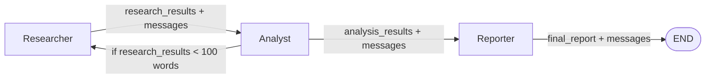

## LangGraph Market Research Multi-Agent

Навчальний приклад мультиагентної системи на LangGraph з архітектурою:

`Researcher -> Analyst -> Reporter -> END`

### Діаграма взаємодії агентів



Система:
- використовує спільний стан `AgentState`,
- додає лог виконання у `messages`,
- зберігає фінальний звіт у Markdown-файл,
- підтримує умовний перехід: якщо даних мало (`< 100` слів), повертає керування до `Researcher`.

### Структура

- `main.py` - стан, вузли, граф, запуск
- `requirements.txt` - залежності
- `.env.example` - приклад змінних середовища
- `reports/` - збережені markdown-звіти (створюється автоматично)

### Встановлення

```powershell
python -m pip install -r module1\langgraph_market_research_multiagent\requirements.txt
```

### Налаштування (опційно)

1) Скопіюйте `.env.example` -> `.env` у цю ж папку  
2) Вкажіть:
- `OPENAI_API_KEY=...`
- `OPENAI_MODEL=gpt-4o-mini` (або інша підтримувана модель)
- `RESEARCH_TOPIC=...` (опційно)

Якщо `OPENAI_API_KEY` не заданий, система працює у fallback-режимі без LLM.

### Запуск

```powershell
python module1\langgraph_market_research_multiagent\main.py
```

### Що перевірити після запуску

- вузли виконалися послідовно (`Researcher`, `Analyst`, `Reporter`),
- у `messages` є трек виконання та (за потреби) loop-події,
- у `reports/` з'явився новий `.md` файл,
- `final_report` містить об'єднані результати дослідження і аналізу.
